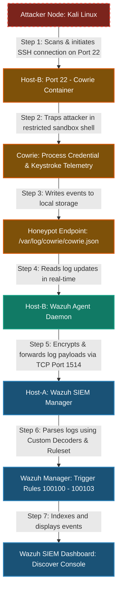

# SOC Honeypot Pipeline: Wazuh SIEM & Cowrie Honeypot Integration

This repository contains the deployment configurations, setups, and analytical resources for building an integrated, active-deception **Security Operations Center (SOC) Honeypot Pipeline**. By running **Cowrie** (a medium-interaction SSH/Telnet honeypot) on an endpoint VM, we capture malicious inputs, parse them via a localized **Wazuh Agent**, and index high-priority alerts inside a centralized **Wazuh SIEM Dashboard**.

---

## SOC pipeline Work Process Flow

The lifecycle of an incident, from initial connection scanning to indexing alerts on the analyst's dashboard, is structured as follows:

---

## Documentation Structure & Navigation

The setup, simulation, and analysis details have been organized into the following step-by-step modular manuals:

### Step 1: [Installation & Setup](docs/INSTALLATION_SETUP.md)
* **Wazuh Manager Deployment**: Setting up the single-node Docker-compose stack on Host-A, allocating system virtual memory parameters, and generating secure TLS certificates.
* **Host-B Configuration**: Moving the host's actual administration SSH port to `22022`, configuring systemd `ssh.socket` activation, and setting firewall policies.
* **Honeypot Service Launch**: Initializing persistent directories, deploying containerized Cowrie, and configuring the docker network.
* **Wazuh Agent Integration**: Configuring `ossec.conf` with a custom JSON reader and correct file permissions.
* **Manager Engine Rules**: Registering custom decoders and XML rule definitions (Rules `100100` to `100103`) to decode Cowrie telemetry.

### Step 2: [Threat Simulation & Execution](docs/EXECUTION.md)
* **Manual Interaction Test**: Simulating an intrusion by logging into the honeypot container on port 22 and running command discovery scripts (`whoami`, `uname -a`).
* **Brute-Force Attack Simulation**: Running automated password-guessing attacks using **Hydra** with standard wordlists.
* **Wazuh Dashboard Verification**: How to search, query, and filter incoming honeypot events (`agent.name: devil`) inside the threat-hunting dashboard.

### Step 3: [Post-Incident Analysis & Telemetry Breakdown](docs/POST_INCIDENT_ANALYSIS.md)
* **Metadata Schema Glossary**: Detailed explanations of parsed fields, including indexed parameters, source IP mappings, credentials, protocols, and unique session tracking hashes.
* **SIEM Alert Priority Matrix**: High-level and warning rule triggers based on levels of intrusion.
* **Incident Sequence Flow & MITRE ATT&CK Mapping**: A visual sequence diagram mapping the phases (Recon, Initial Access, Defense Evasion, and Discovery) to the security framework matrix.
* **SOC Action Items**: Automation guidelines including active firewall shunning, log correlation, and intelligence-gathering.

---

## Stack Components & Technologies
* **SIEM Core**: Wazuh Manager & Dashboard (Docker Containerized)
* **Adversary Deception**: Cowrie Honeypot (Medium Interaction SSH/Telnet decoy)
* **Log Transport**: Wazuh Agent (Local Endpoint Daemon)
* **Container Host & Engine**: Docker & Docker Compose V2
* **Visualization Interface**: OpenSearch Dashboard (Wazuh UI Integration)
* **Simulators**: Kali Linux, Hydra (Brute-force Engine)
