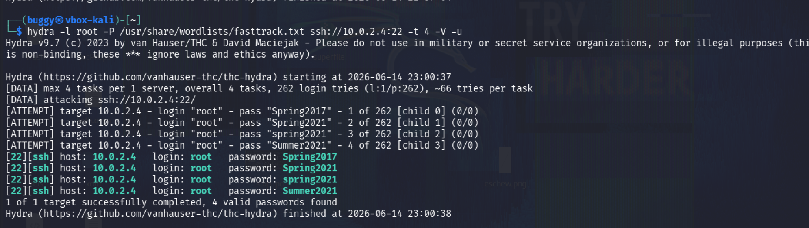
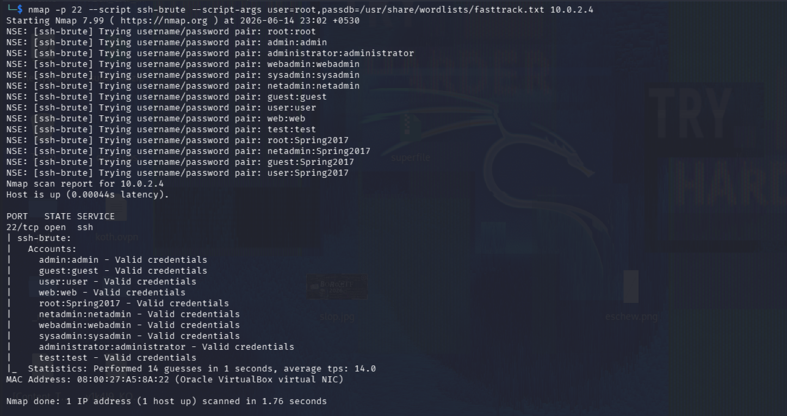
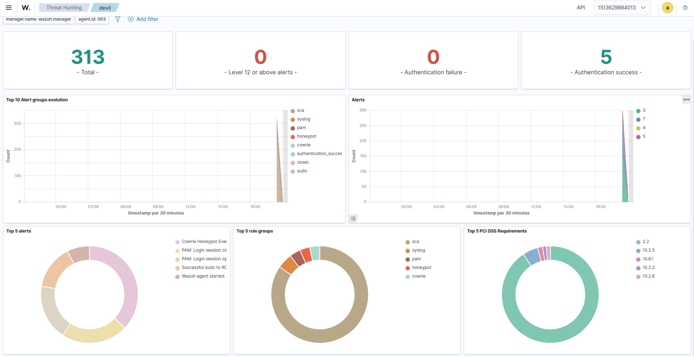
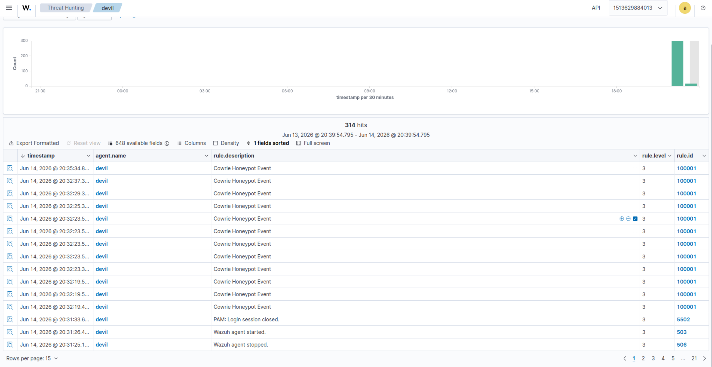
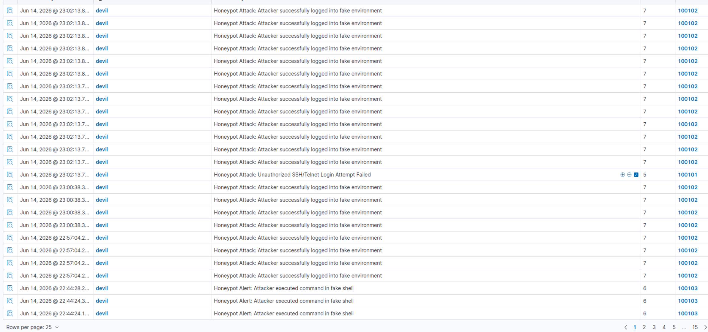
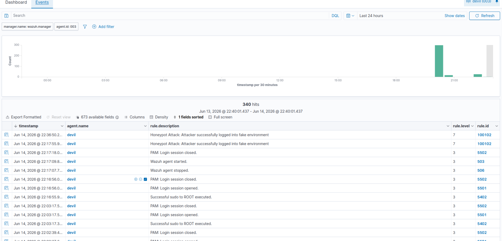
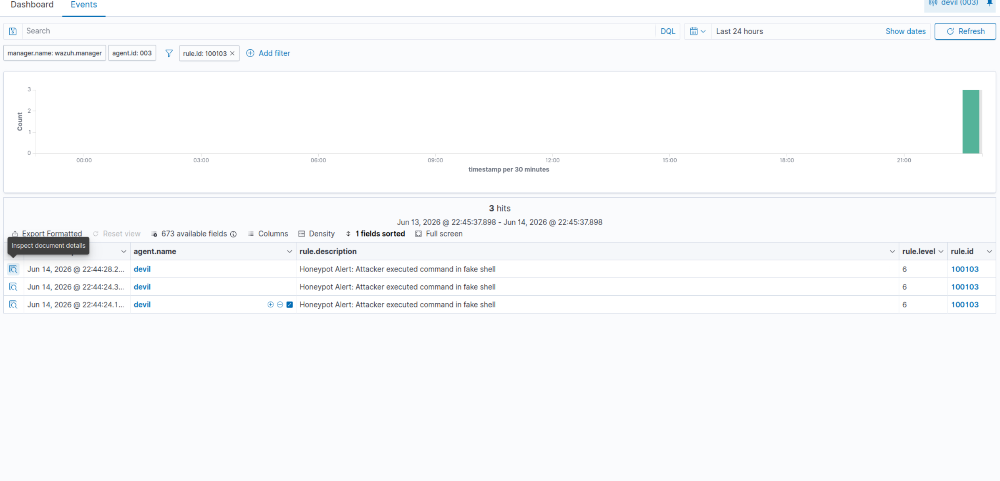
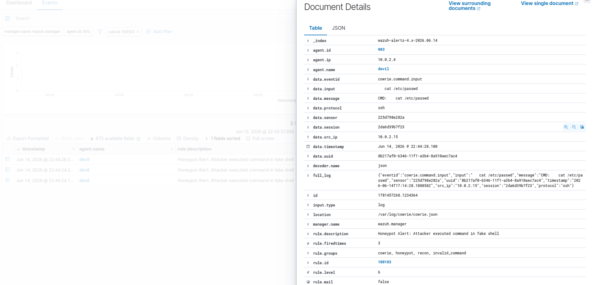
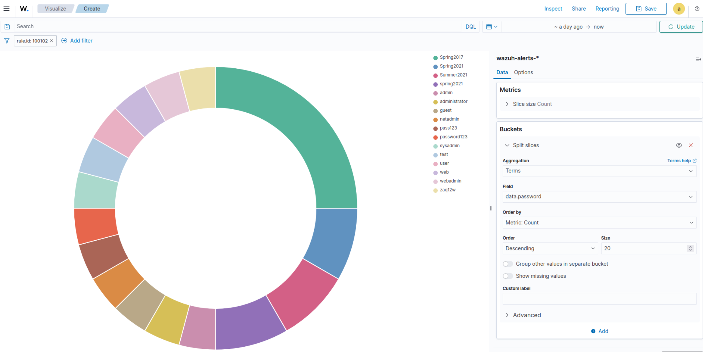

# Threat Simulation & Execution Guide

This document guides you through running attacks from Host-C (Kali Linux) to verify that the SOC Honeypot Pipeline successfully intercepts, transmits, and visualizes security alerts.

---

## Table of Contents
1. [Test 1: Manual Connection & Keystroke Simulation](#test-1-manual-connection--keystroke-simulation)
2. [Test 2: Automated Password Guessing (Hydra)](#test-2-automated-password-guessing-hydra)
3. [Dashboard Visualization & Analytics](#dashboard-visualization--analytics)

---

## Test 1: Manual Connection & Keystroke Simulation

This test verifies that standard SSH connection requests are successfully trapped in the Cowrie docker container, rather than reaching Host-B's underlying operating system.

### 1. Initiate SSH Connection from Host-C (Kali)
Run the standard SSH command targeting the honeypot IP address on the default port (**22**):
```bash
ssh root@<Host-B-IP>
```

### 2. Simulate Attacker Actions
* Enter a common/weak password when prompted (e.g. `password123`).
* Cowrie will intercept the request and grant access to a mock file system sandbox.
* Run a series of recon commands to mock a live intruder:
```bash
whoami
uname -a
cat /etc/passwd
exit
```

---

## Test 2: Automated Password Guessing (Hydra)

To test the resilience and density of log ingestion, simulate an automated brute-force threat vector utilizing Hydra.

### Run Hydra Brute-Force Command
```bash
hydra -l root -P /usr/share/wordlists/fasttrack.txt ssh://<Host-B-IP>:22 -t 4 -V
```

* `-l root`: Targets the administrative root username.
* `-P`: Specifies the path to the FastTrack wordlist on Kali.
* `-t 4`: Restricts execution concurrency to 4 parallel workers.
* `-V`: Enables verbose output.

This test will generate hundreds of rapid login failures, validating that the pipeline handles bulk security logs gracefully.



#### Alternative: Nmap SSH Brute-Force
Alternatively, you can simulate a brute-force attack using Nmap's `ssh-brute` script:
```bash
nmap -p 22 --script ssh-brute --script-args user=root,passdb=/usr/share/wordlists/fasttrack.txt <Host-B-IP>
```



---

## Dashboard Visualization & Analytics

Verify that Wazuh is processing these telemetry events and displaying them clearly.

### Finding Alerts in the Wazuh UI
1. Navigate to the Wazuh Web UI at `https://<Host-A-IP>`.
2. Open the navigation menu (top-left) and go to **Threat Hunting -> Discover**.
3. In the search bar, filter by your agent name:
   ```plaintext
   agent.name: devil
   ```
4. To view specific simulated security exceptions, you can query by the rule IDs:
   * `rule.id: 100101` — Identifies failed login attempts.
   * `rule.id: 100102` — Identifies successful logins (attacker entered the honeypot sandbox).
   * `rule.id: 100103` — Shows the exact commands run inside the honeypot shell.



When viewing all events for the agent under the Discover dashboard, you will see general honeypot events matching the customized rule groupings:



During a brute-force attack (e.g. from Hydra), you will observe multiple failed attempts (`100101`) followed by successful compromise alerts (`100102`):



Filtering for the successful login alert `rule.id: 100102` shows the list of successful connections:



### Inspecting Command Execution (Rule 100103)
Expand one of the `rule.id: 100103` logs by clicking the arrow or the magnifying glass icon. Look for the `data.input` field; it contains the exact text of the command the attacker typed (such as `whoami`, `uname -a`, etc.).
This confirms that the keystroke capturing pipeline is fully functional and logged in OpenSearch!





### Visualizing Password Telemetry
You can create custom visualizations (e.g. donut charts) to analyze the credentials used by the attacker. By grouping on the `data.password` field for rule `100102` (or `100101`), you can see the distribution of common passwords attempted during brute-force campaigns:


