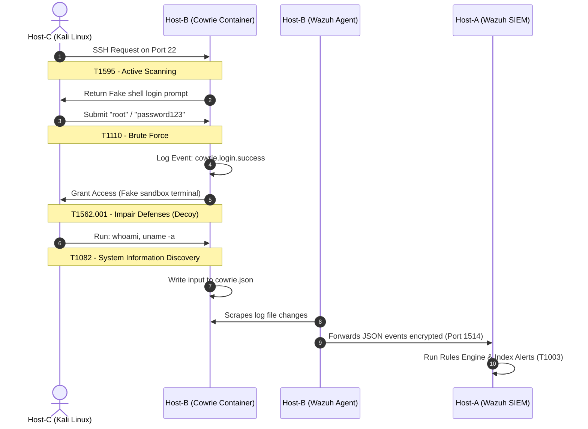

# Post-Incident Analysis & Telemetry Breakdown

This document provides a post-exploitation telemetry analysis of the simulated attacks, mapping events to standard security schemas and recommending mitigation strategies for Security Operations Center (SOC) teams.

---

## Table of Contents
1. [Telemetry Log Breakdown (Field Glossary)](#telemetry-log-breakdown-field-glossary)
2. [SIEM Rule Matching Matrix](#siem-rule-matching-matrix)
3. [Security Incident Narrative & MITRE ATT&CK Mapping](#security-incident-narrative--mitre-attck-mapping)
4. [SOC Security Recommendations](#soc-security-recommendations)

---

## Telemetry Log Breakdown (Field Glossary)

The following schema maps Cowrie log keys to their corresponding indexed fields in the Wazuh manager's OpenSearch database:

| Wazuh Log Field | Raw Metadata Value | Security Operational Definition |
| :--- | :--- | :--- |
| `_index` | `wazuh-alerts-4.x-2026.06.14` | The explicit database table index where log events are archived. |
| `agent.name` | `devil` | The endpoint hostname reporting the security exception. |
| `data.src_ip` | `10.0.2.15` | The threat actor's source IP address (Host-C). |
| `data.username` | `root` | The specific system user targeted by the threat actor. |
| `data.password` | `password123` | The raw credential phrase processed during login. |
| `data.protocol` | `ssh` | The application layer protocol targeted by the adversary. |
| `data.eventid` | `cowrie.login.success` | The state schema confirming entry into the decoy environment. |
| `data.session` | `28bcc6aa8fdf` | A cryptographically unique hash pinning all actions to a single connection. |
| `location` | `/var/log/cowrie/cowrie.json` | The file source validated by the Wazuh Agent tail daemon. |

---

## SIEM Rule Matching Matrix

When raw logs are ingested on Host-A, the custom rules engine triggers alerts based on severity ratings:

| Custom Rule ID | Alert Severity Level | Decoded Event ID | Triggering Behavior |
| :--- | :--- | :--- | :--- |
| **100100** | Level 0 (Silent) | `^cowrie\.` | Base grouping rule to identify Cowrie alerts. |
| **100101** | Level 5 (Notice) | `cowrie.login.failed` | Attacker failed a login attempt. |
| **100102** | Level 7 (Warning) | `cowrie.login.success` | Attacker successfully logged into the fake sandbox. |
| **100103** | Level 6 (Notice) | `cowrie.command.input` | Attacker typed a command inside the fake shell. |

---

## Security Incident Narrative & MITRE ATT&CK Mapping

### Incident Timeline Analysis
* **Phase 1: Reconnaissance & Initial Access (T1595 / T1110)**  
  The adversary performs scans on Host-B's external face. They initiate connection on port `22`. Because Host-B's administration portal is isolated on port `22022`, the connection is seamlessly routed to the containerized honeypot.
* **Phase 2: Exploitation & Defense Evasion (T1562.001)**  
  The adversary tries common system logins (`root` with `password123`). The honeypot responds with a success signal. The adversary is trapped inside a secure sandbox container, unable to access host files, kernel memory, or the internal network.
* **Phase 3: Discovery & Collection (T1082 / T1003)**  
  The adversary runs host discovery commands (`whoami`, `uname -a`). Each keystroke is logged locally in JSON format on Host-B. The Wazuh Agent instantly extracts the new lines, sends them to Host-A, and indexes the telemetry.

---

## SOC Security Recommendations

1. **Active Response Integration:** Update Wazuh Manager configs to automatically run firewall block commands (`iptables` or `ufw`) on Host-B when `rule.id: 100101` (login failures) or `rule.id: 100102` (honeypot compromise) are fired from an external source IP.
2. **Session Identification & Incident Correlation:** Utilize the cryptographically unique `data.session` hash in OpenSearch to filter all commands entered during a single attacker session for threat intelligence reviews.
3. **Internal Threat Feeds:** Automate extracts of captured attacker credential payloads (`data.password`) to cross-reference and enhance company-wide internal password policies.

